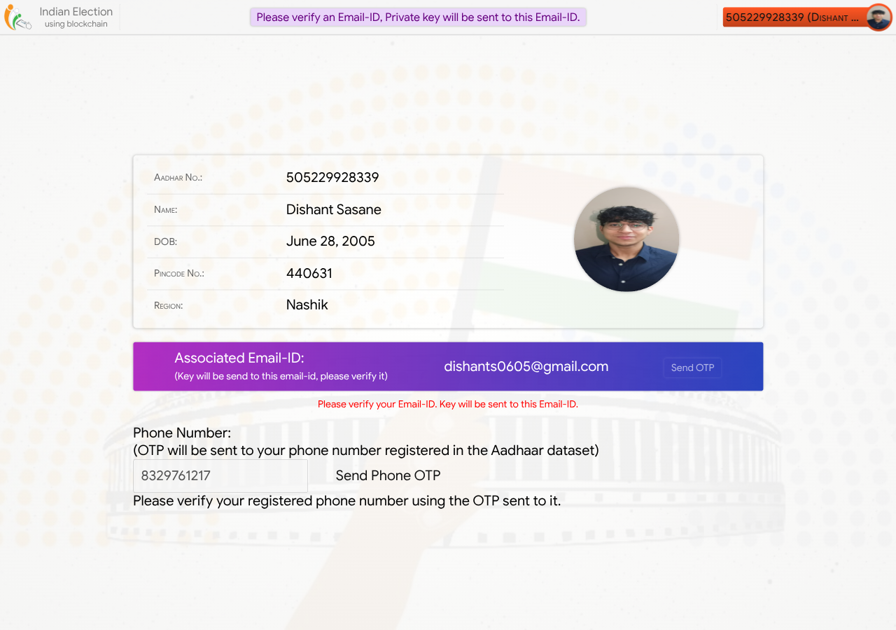
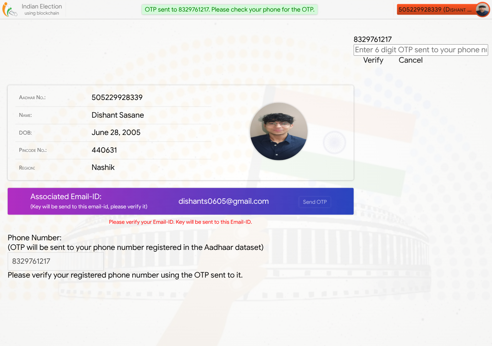
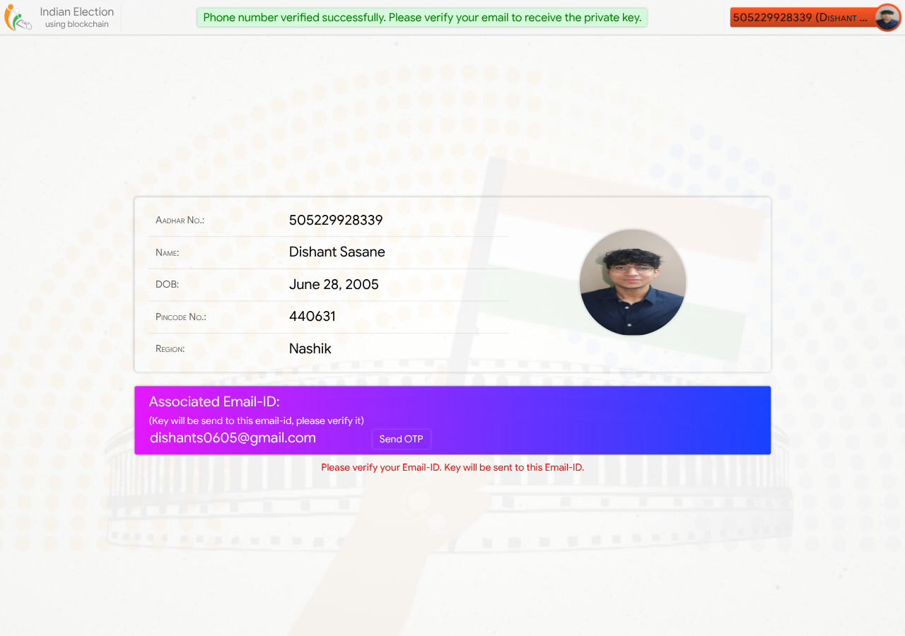
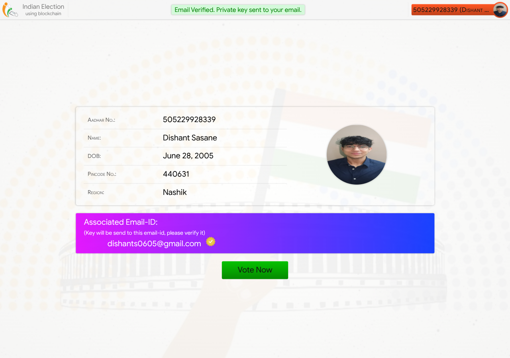
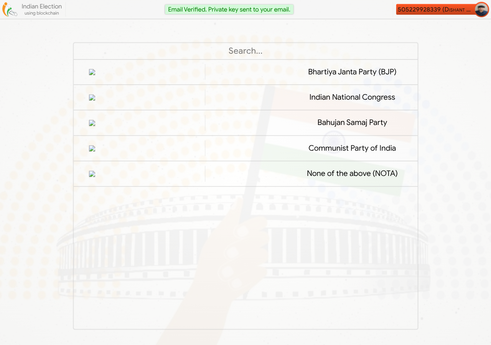
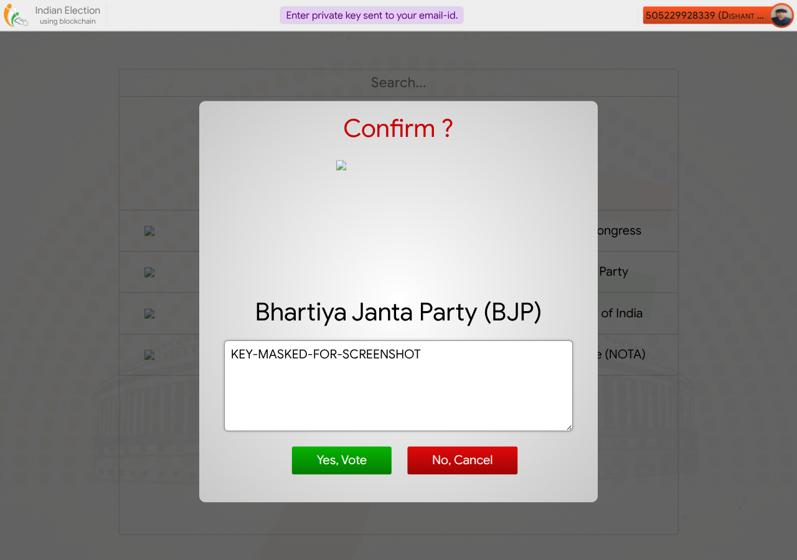
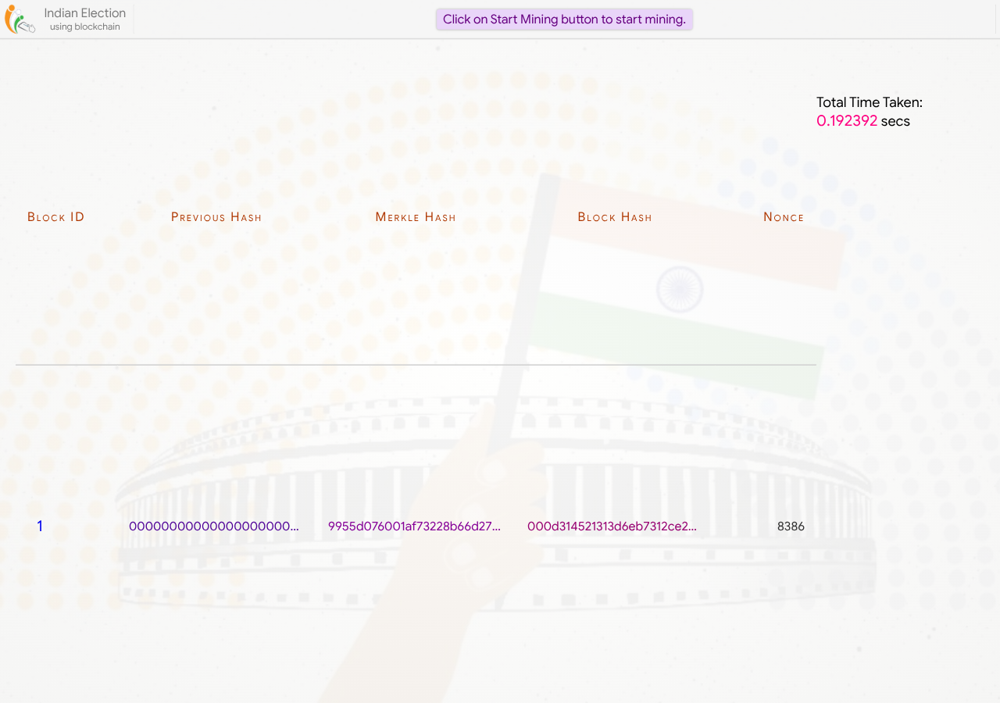
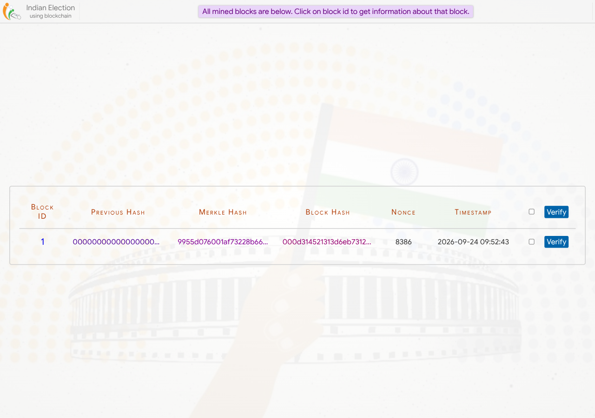
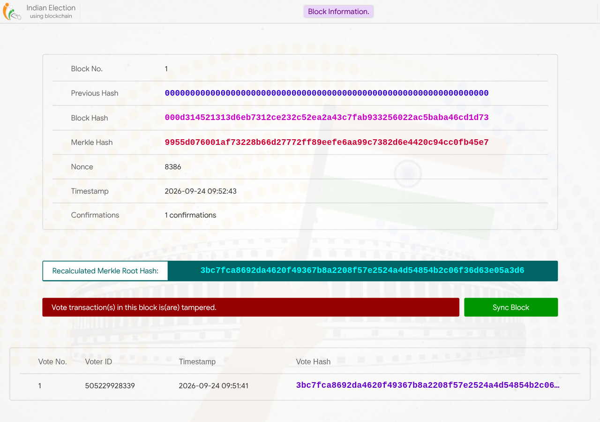
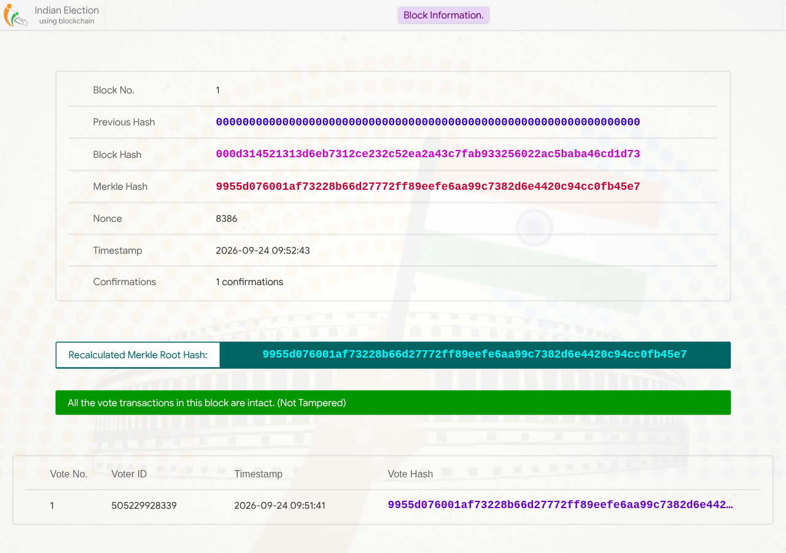

# Kleroschain

A blockchain-based e-voting system built with Django. Votes are signed with
ECC keypairs, sealed into Proof-of-Work blocks, and verified against a Merkle
root — any tampering with a cast vote is detected and can be recovered from a
synced backup.

## Features

- **Two-factor voter verification** — Aadhaar lookup → phone OTP → email OTP,
  each stage gated server-side (not just hidden in the UI).
- **Signed votes** — each vote is signed with the voter's ECC private key
  (sent once via email) and verified against their public key before it's
  accepted.
- **Proof-of-Work blockchain** — votes are mined into blocks; block integrity
  is checked via Merkle tree hashing.
- **Tamper detection & recovery** — editing a cast vote directly in the
  database is detected on verification, triggers an alert, and can be
  restored from backup via "Sync Now".
- **One vote per voter** — re-authentication after voting is rejected.

## Architecture

```
project/
├── aadhaar_mock_data_100_records.xlsx   # mock voter dataset (100 records)
└── voting/                               # Django project root
    ├── Election/                         # settings, urls, wsgi
    └── home/
        ├── models.py                     # Voters, Block, Vote, MiningInfo
        ├── views.py                      # auth, OTP, voting, mining, tamper endpoints
        ├── merkle_tool.py                # Merkle tree construction/verification
        ├── methods_module.py             # ECC sign/verify, PoW mining
        └── templates/, static/           # UI
```

## Setup

```bash
cd project/voting
python -m venv .venv && source .venv/bin/activate
pip install -r requirements.txt
```

In `Election/settings.py`, set `EMAIL_ADDRESS` / `EMAIL_PASSWORD` for the
Gmail account used to send OTPs and private keys (see
[project/voting/README.md](project/voting/README.md) for the app password
walkthrough).

```bash
python manage.py migrate
python manage.py runserver
```

Visit http://127.0.0.1:8000.

## Evaluation

Full manual test results (16 scenarios, tamper-detection matrix, mining
performance) are in [evaluation/RESULTS.md](evaluation/RESULTS.md), captured
on an AMD Ryzen 5 5600H / Ubuntu 24.04 / Django 6.1.1.

## Walkthrough

| Step | Screenshot |
|---|---|
| Home |  |
| Aadhaar auth success |  |
| Phone OTP prompt |  |
| Phone OTP verified |  |
| Email OTP verified |  |
| Ballot list |  |
| Vote confirmation |  |
| Vote signed & recorded |  |
| Mining a block |  |
| Blockchain view |  |
| Block detail |  |
| Tamper detected |  |
| After sync/recovery |  |

## Known limitations

- OTP verification endpoint has no rate limiting (brute-force possible).
- Re-mining with a corrupted backup can bypass tamper detection — see
  [evaluation/RESULTS.md](evaluation/RESULTS.md) for details.
